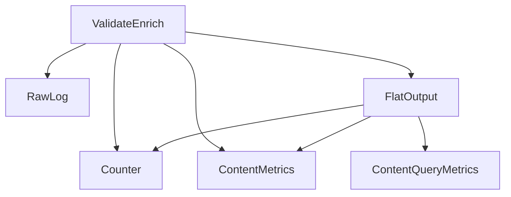

# Overview
The "big picture" goals of the Flink pipeline is best illustrated in the [Metrics Solution diagrams](https://drive.google.com/drive/folders/1wtHCBk3hGdr7vbWi2kD42zc4FDnpRrPV) and the `Detailed Diagrams` subfolder.  Some notable diagrams are:
* Stale [System Overview - Presentation](https://drive.google.com/file/d/19mwOiuxUji-T_Zxqcr4J2NDgZXHypmd6/view?usp=sharing) - (intended) general flow of data between the major systems at promoted.ai
* Stale [Metrics Solution](https://drive.google.com/file/d/1IqrMIY-S8hcsOp7bUnTAHhUgBy1SaJre/view?usp=sharing) - illustrates the metrics use cases
* Stale [Detailed Diagrams/Metrics](https://drive.google.com/file/d/1TI9C0e-2B9qwLQDlyQqRuclLRxzko611/view?usp=sharing) - service level diagram of metrics stack components and jobs



There are currently three streaming jobs:
1. ValidateEnrich Job - Validates LogRequest records.  Some some small enrichment.  Saves records to Kafka.
2. RawOutput Job - Logs records from Kafka to S3 (Hudi, Avro and/or Parquet).
3. FlatOutput (Join) Job - Creates join tables such as `joined_impression`, `joined_action` and `flat_response_insertion`.  This job has a joining/attribution stage and then a denormalization stage.
3. Counter Job - Count impression and actions over various segments for delivery.
4. ContentMetrics and ContentQueryMetrics Job - Produces ETL tables that contain aggregate metrics by contentId (and query).

## Why Flink?

We need a real-time data processing system that can scale (>1B log records per day per marketplace) and has fast end-to-end latency (on the order of seconds).  Flink is the leading open source solution for solving this problem.  It's designed for stateful streaming.  It scales better than current alternatives.

# Setup

## Requirements

* You need to setup Kubernetes (k8s) via minikube for local development.
* Kafka running on k8s.  Please see `//kafka/README.md` for details on how to set Kafka up.
* MinIO is an S3-compatible/replacement service we can run locally via minikube.  We use this so we can run the full stack locally.

## Setup the local development dependencies.

See the [workstation setup docs](https://github.com/promotedai/workstation/blob/master/local-env.md).


## Setup Flink pipeline locally.

### Simple local setup

You need to set up Minikube locally with a `metrics` K8s namespace.  Internal devs can use instructions in our `workstation` repo. 

Recommendation: start just the jobs you need.  The jobs consume a lot of resources.

Start Kafka with the required topics.  The easiest way to:

```bash
cd metrics/kafka
make local
```

Start Flink operators, MinIO and Redis.

```bash
cd metrics/pipeline
make local
```

Write some fake event data.

```bash
make local-fake-log-generator-setup
```

Start up ValidateEnrich job.

```bash
make local-validate-enrich-job-setup
```

Optionally, run the join job if your job needs joined outputs.

```bash
make local-flat-output-job-setup
```

Then start the job you want to run.


### General command structure

Most local commands have a `-setup` and `-clean` version.  Clean tears down the jobs.

Most of the Make commands just run `kubectl` commands.  If you want to delete and apply, you can chain the commands.  Example using fake `foo` command:

```bash
make local-foo-clean && make local-foo-setup
```

### Detailed commands

Overall setup

|**Command**|**Description**|
|-----------|---------------|
|`make local`|Setup Flink Operator, MinIO, Redis|
|`make clean-local`|Tears down those resources|
|`make local-flink-operator-setup`|Setup Flink Operator|
|`make local-flink-operator-clean`|Tear down|
|`make local-minio-setup`|Setup MinIO|
|`make local-minio-clean`|Tear down|
|`make local-redis-setup`|Setup Redis|
|`make local-redis-clean`|Tear down|

You can do similar things with jobs
|`make local-raw-output-job-setup`|Deploy the raw output jobs|
|`make local-raw-output-job-clean`|Stops the current raw output jobs and deletes the k8s config|


### Data population

Usually only the `fake-log-generator` is needed.

|**Command**|**Description**|
|-----------|---------------|
|`make local-fake-log-generator-setup`|Deploy a job that writes fake log records to Kafka.  Writes to Kafka|
|`make local-fake-log-generator-clean`|Deletes the k8s config|
|`make local-fake-content-generator-setup`|Deploy a job that writes fake content records to Content API.|
|`make local-fake-content-generator-clean`|Deletes the k8s config|


### Flink jobs

|**Command**|**Description**|
|-----------|---------------|
|`make local-validate-enrich-job-setup`|Deploy the ValidateEnrich job.  Validates and enrichs log records.|
|`make local-validate-enrich-output-job-clean`|Stops that job|
|`make local-raw-output-job-setup`|Deploy the RawOutput job.  Writes records to S3 (MinIO locally).|
|`make local-raw-output-job-clean`||
|`make local-flat-output-job-setup`|Deploy the FlatOutput job.  Joins events.|
|`make local-flat-output-job-clean`||
|`make local-counter-job-setup`|Deploy the Counter job|
|`make local-counter-job-clean`||
|`make local-content-metrics-job-setup`|Deploy the ContentMetrics job|
|`make local-content-metrics-job-clean`||
|`make local-content-query-metrics-job-setup`|Deploy the ContentQueryMetrics job|
|`make local-content-query-metrics-job-clean`||

# Development

## Conventions

### Operator uid

WARNING: This section needs updating after we deploy Hudi and use more Flink SQL.  The current Hudi Flink writer needs to auto-generate Flink uids.

We disable autogeneration of Flink uids because they regularly create forwards incompatible releases.  We enforce some conventions in unit tests, but rely on devs to adhere to them.  Defer to the conventions outlined in [UidChecker](https://github.com/promotedai/metrics/blob/develop/pipeline/src/test/java/ai/promoted/metrics/logprocessor/stream/UidChecker.java) if there's disagreement between here and there.

General convetions should be:
1. no spaces or silly casing; just lowercased and hyphens
2. verb -> nouns
3. specific -> general
4. use the uid as the name of the operator (and generally keep related outputs similarly named)

For example, `count-hourly-item-event`, `join-impression-action`, and `timestamp-and-watermark-source-kafka-view` are appropriate.

## Set Up Environment Variables
```
# generally do this whenever you're about to run kubectl commands for local development below
. ~/promotedai/metrics/config/config.sh; export NAMESPACE=$LOCAL_K8S_NAMESPACE; eval $(minikube docker-env)
```

## Sending fake log data

Run `make local-fake-log-generator-setup` to send fake input log records to Kafka.

The default join job and fake data generator outputs ~681 flat-impressions.  Even though there are 700 raw impressions, we drop some due to a combination of using fake data for inferred references, a smaller range of contentId and a setting to reduce redundant impressions.

## Joining in Content data

The Join job joins content from Content API in order to get additional foreign content keys.  These keys are used for attribution when actions have different content types than the insertions.  E.g. insertion for a store but purchase on an item.

### Content joining in production

In production, the Join job will use the Content API.  It'll get the api key from the AWS Secrets Manager.

## Content joining when developing locally

The default local setup does not join in Content details from Content API.  Here are rough steps from Dan for doing this locally:
1. Run [`contentstoreapi`](https://github.com/promotedai/contentstoreapi) locally outside of Minikube.  You'll need to start a standalone MongoDB instance.
2. Run `ngrok http 5150` for `contentstoreapi`.  It's easier to have the Minikube Flink Join job hit the ngrok URL. than using other addresses.
3. Modify the following k8s yamls to use the content store flags: `--contentApiRootUrl` and `--contentApiKey`.
  - `pipeline/kubernetes/local/fake-content-generator.yaml`
  - `pipeline/kubernetes/local/flat-output-job.yaml`
4. Write fake content data to the local Content API.

  ```bash
  make local-fake-content-generator-clean && make local-fake-content-generator-setup
  ```
5. Startup the Join job.

  ```bash
  make local-flat-output-job-clean && make local-flat-output-job-setup
  ```

## Connect to Flink UI

Here's an example command for connecting to a Flink JobManager UI.

```bash
kubectl -n metrics port-forward svc/raw-output-flink-job-blue-rest   8081:8081
```

Then visit http://localhost:8081 to load the Flink UI.

## Connect to MinIO UI.

In a different terminal, run (and keep it running)
```
minikube -n metrics service minio-console --url
```

On a Mac, this outputs
```
😿  service yournamespace/minio-console has no node port
http://127.0.0.1:59633
❗  Because you are using a Docker driver on darwin, the terminal needs to be open to run it.
```

When you load the UI, you will be asked for access keys.  We use the default keys since we are only using MinIO locally:
* accessKey=`YOURACCESSKEY`
* secretKey=`YOURSECRETKEY`

### MinIO CLI Client
Once you've port forwarded MinIO on port 9000, you can install the `mc` command line utility:

1. `brew install minio-mc`
2. `mc alias set local http://localhost:9000 YOURACCESSKEY YOURSECRETKEY`

Hereafter, you can use `mc` commands to query `local/` to manipulate files via command line.  Remember, you need to have MinIO port-forwarded to have these work.

#### Copy an entire subfolder from minio
```
# here, we're copying everything under etl
mc cp --recursive local/promoted-event-logs/etl .
```

#### Remove all files from the default minio local path
```
mc rm -r --force local/promoted-event-logs
```

## Connect to Redis.
```
kubectl -n metrics port-forward svc/redis-cluster 6379
redis-cli -h localhost -p 6379
```

## Java profiling via JMX
1. `brew install visualvm` or whatever floats your JMX boat
2. Edit `kubernetes/local/flink-values.yaml` and uncomment the `flink.params.env.java.opts.taskmanager` value to enable the JMX server within our binaries.  Note: you can do this for canary and production jobs as well if you need to.
3. You can connect to the flink taskmanager at anytime, so it’s suggested to do so before starting up any actual pipeline jobs in case you want to catch the runtime characteristics of startup and/or early execution.
4. Simply port forward the default jmx port (1099):
   ```
   kubectl -n ${NAMESPACE} port-forward flink-taskmanager-0 1099
   ```
5. fire up visualvm and make a local connection to 1099
   1. Add JMX Connection (toolbar or right-click on Local)
   2. Connection: `localhost:1099`
   3. Make sure `Do not require SSL connection` is unchecked
   4. [optional] uncheck “Connect automatically”.  You can manually connect and disconnect by right clicking on the `Application` entry on subsequent runs.


## More Useful Tips

Many of these are just docker-compose helper commands.

### Log fetching
There are a few ways to get logs.  The direct `kubectl logs` might not give the job logs you want.  The job's logs are in a `/opt/flink/log/*.out`.

```
# fetches the job population logs (hint: execution plans are output here if coded to do so)
kubectl -n metrics logs pod/{pod}
# lists all logs available in the local flink taskmanager
kubectl -n metrics exec -ti pod/{pod} -- ls /opt/flink/log
# grabs the last 100 lines of the log file of a local flink taskmanager
kubectl -n metrics exec -ti pod/{pod} -- tail -n 100 /opt/flink/log/flink--taskexecutor-0-flink-taskmanager-0.log
# grabs the last 100 lines of the stdout of a local flink taskmanager
kubectl -n metrics exec -ti pod/{pod} -- tail -n 100 /opt/flink/log/flink--taskexecutor-0-flink-taskmanager-0.out
```

### Kafka topic inspection
You need to run kafka-testclient first.
```
# dumps the tmp-output topic to stdout
kubectl -n metrics exec -ti kafka-testclient -- kafka-console-consumer --bootstrap-server kafka:9092 --topic tmp-output --from-beginning
```

### Hit the Flink REST API
Assumes you've exposed the flink jobmanager's 8081 port via [port forwarding](#connect-to-flink-ui).
```
# lists all jobs
curl localhost:8081/jobs
# note: use a job-id fetched from the /jobs get
curl localhost:8081/jobs/<jod-id>
curl "localhost:8081/jobs/<jod-id>/metrics?get=lastCheckpointSize"
```

### Run Flink command line
```
kubectl -n ${NAMESPACE} exec -ti flink-taskmanager-0 -- flink --help
kubectl -n ${NAMESPACE} exec -ti flink-taskmanager-0 -- flink list
```

### Stopping a Flink job with a savepoint
Use Flink K8s Operators.  If you make a change to the K8s file and want to re-run it, run the make setup command again.

### Restart using a savepoint
Use Flink K8s Operator.  You can set `spec.job.initialSavepointPath` to the savepoint url.

### Manual throughput testing
Add the following to the local Flink configs.  This will print metrics to the text logs.

```
metrics.reporter.slf4j.factory.class: org.apache.flink.metrics.slf4j.Slf4jReporterFactory
metrics.reporter.slf4j.interval: 60 SECONDS
```

To filter down the values, here's an example query

```bash
kubectl -n metrics exec pod/{pod} -- cat log/flink--taskexecutor-0-flink-taskmanager-0.log  | grep "numRecordsOut" | grep "join-event" | grep "Join insertion to impressions.0" | sed "s/^.*numRecordsOut/numRecordsOut/"
```

This gives records like
```
numRecordsOutPerSecond: 0.0
numRecordsOut: 0
numRecordsOutPerSecond: 0.0
numRecordsOut: 416
numRecordsOutPerSecond: 5.133333333333334
numRecordsOut: 1400
numRecordsOutPerSecond: 18.2
numRecordsOut: 1400
numRecordsOutPerSecond: 0.0
numRecordsOut: 1400
```

# Deploy

Notes are in the [deploy script README](pipeline/scripts/deploy/README.md).

# Testing

Notes are in [tests.md](tests.md).

# Operations

## Lessons learned from backfilling data

The most impactful on backfill throughput:
- Performance of underlying Flink code. Example: `KeyedStream.intervalJoin` slows down exponentially with duplicate event IDs.  Understanding the underlying execution allowed us to actually finish a backfill.

Helps increase backfill throughput:
- Increase memory. Flink memory settings are a little tricky to get right. `memoryProcessSize` does not represent all of the memory that Flink allocates (even though the documentation says it is).  RocksDB can allocate extra memory.
- Reducing checkpoint intervals. Checkpoints are meant to help recovery if there is a disaster.  Checkpoints take time.
- Increase savepoint timeouts.
- Reducing number of running tasks and slots on the task manager.

Did not help:
- Disk size.

# Resources

* [Apache Flink](https://flink.apache.org/)
* [Apache Kafka](https://kafka.apache.org/)
* [Kubernetes](https://kubernetes.io/)
  * [Amazon Elastic Kubernetes Service (EKS)](https://aws.amazon.com/eks/)
  * locally, [Minikube](https://minikube.sigs.k8s.io/) and [Docker](https://www.docker.com/)
* [MinIO](https://min.io/)
