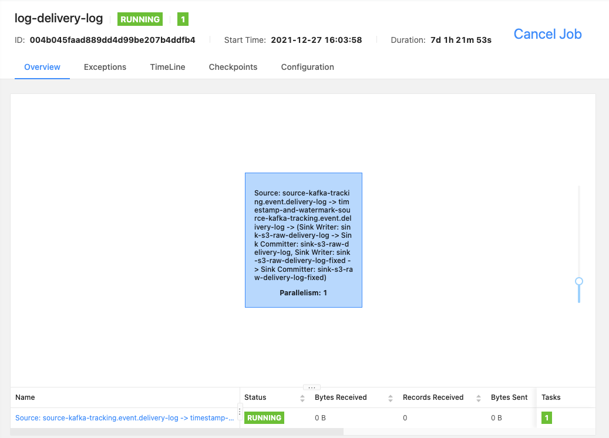

# Overview

This is where all of our Flink stream processing jobs are defined.

## Gotchas

There are some subtleties/gotchas that are important enough to lead this documentation with.  They greatly affect how everything works, so it's important one understands it thoroughly.

### Event Timestamps

All of our streaming jobs use event time semantics (instead of process time semantics).  As such, we need to agree on which of the potential timestamps within our metrics data flow up to these pipelines are considered the event time:
* client log timestamp

  This is the timestamp set by the system/service originating the event.  Usually, this is set in our various SDK layers, and examples include a mobile application or a platform's server.  Because this is distributed and not likely well coordinated (let alone gauranteed to be coordinated), this timestamp is not used for our event timestamps within Flink.  At best, they could be used to order events *only* for a single event source, never across sources.

* event api timestamp

  This timestamp is generated by the Metrics Event API upon receipt of the event message.  The scaling here is also distributed with the same potential time coordination issues (for now...), this timestamp is not used for our event timestamps within Flink.  *However*, it is used for the s3 file output timestamps, which means it is the value used for the date (`dt`) and `hour` file path partitions used in our S3 paths.  This in turn affects the semantics of `dt` and `hour` in Athena queries over our tables.  Consequentially, the Counter job uses this timestamp for time bucketing for consistency with batch/backfill generation of the counts using Athena.  We should probably move to the same event time semantic as we have in flink (kafka timestamps, next), or...

  Eventally, we may want to standardize on this as our event timestamp if we can ensure good time coordination between our Event API servers at a sufficient resolution/granularity.   If millis is sufficient, we can use NTP based approaches like Amazon Time Sync Service.  Otherwise, we should consider solutions that are good for micros or better percision, like Precision Time Protocol (PTP).  On the other hand, this timestamp suffers from network effects since it's a RPC hop from the originating source (client log timestamp).

* **kafka timestamp**

  This is the timestamp set by kafka when the event message is inserted into a kafka topic.  **This is what we currently use for our event time semantics in Flink.**  We are relying on the time coordination of Kafka to provide.  TODO: we should understand the guarantees/SLAs on the consistency and precision of these timestamps.

* log timestamp

  This timestamp is used internally in our Flat Output Job to try and use the correct kafka timestamp of either the left or right hand side of the join on the resulting JoinedEvent.  So, it's still in the kafka timestamp domain.  We use this mainly to get our temporal distances for inferred joins.

### Timers, Delays and Watermarks

We rely on timers to handle time-bounding certain logic (similar to flink windowing operators like interval joins) extensively in order to accrue enough state to make a better decision.  This introduces additive delay in the stream processing pipelines which make it less real-time, but this enables us to actually do some work with some amount of correctness.  In the post-retractions future, we should be able to greatly minimize to the needed delays or outright elminite them.

Given event time semantics and bounded watermark generation which we also use, we have to capture our timer delays on the operators that have them by "lowering" the operator's output watermark by the maximum delay imposed by the timer(s) of the operator.  This is handled explicitly via the [Keyed\*ProcessOperatorWithWatermarkDelay](../common/flink/operator) operators.  Inferred references based joins is a great example of this to walk through.

#### *Important* - we periodically update the watermark when developing locally

In production, we currently do not progress the watermark until Kafka has more recent data.  We will eventually change this to always populate each log record regularly.

Locally, we progress the watermark when sources are idle (configurable, ~1m default) to simplify local development.  The actual amounts are defined with these options `max.*OutOfOrderness` and `watermarkIdleness`.

## RawOutputJob.java - Raw Output Job

This job is actually many individual jobs executed by a single binary.  The actual jobs are considered "sub jobs" per the command line argument.  They are pretty simple jobs where they read from the [Metrics Event API](/api/README.md)-generated Kafka streams and output the protos in a structured format (currently, avro) to S3.  For example, here's what the typical job graph for a raw output job looks like:

In general, any new Metrics Event API kafka streams must have a raw output sub job defined for it.  That way, we can later leverage our S3 archives of those events in case we need to replay more than what's stored in Kafka.

### Sources
1. Single Metrics Event API Kafka topic

### Input Validation

We have very little validation on incoming events.  We started adding some to the join job.  Invalid records are ignored and `ValidationError`s are recorded to a Parquet table in S3.

`Validate{RecordType}` classes contain validation logic.  These are currently hard-coded.  Dan was not able to find a good validation framework for protos that he thought would be performant.

The validation structure will change a lot in the future.  We want to pull the validation to a separate job and write validated events to a different Kafka topic.  We will change the format of the table after working through future requirements.

### Sinks
1. S3 File Sink (`s3a://hipcamp-dev-event-logs/raw*`)

### Implementation
It's simply connecting the Kafka input source to a respective S3 file sink.

## FlatOutputJob.java - Flat Output Job

This is *the* BFJ.  The purpose of this job is to generate JoinedEvent and FlatResponseInsertion protos which are flattened (denormalized) log records of some event type.  JoinedEvent protos capture flattened events relative to Impressions or Actions, and FlatResponseInsertions capture flattened events relative to a response insertion where all downstream Impressions and Actions for the given response insertion are collected.

For now, it's the most complicated pipeline, but we have the groundwork in place to break this up even more depending on trading off the utility of the refactor versus operational and coding costs.  It's so large, we can't embed a simple job graph screengrab image here.  Instead, inspect the job graph via a running Flink UI of the running job (`join-event`) or please follow these steps to load the job graph in https://flink.apache.org/visualizer/:

1. copy the execution plan of the current job: `cat flat-output-job.json | pbcopy`
2. paste (cmd-v) the json data into the text area on https://flink.apache.org/visualizer/
3. you will have to `Zoom Out` and pan around with the mouse to likely see stuff since the initial render of the graph starts with the viewport on the upper left of the image which is usually blank

### Sources
1. Single Metrics Event API Kafka topic

### Sinks
1. S3 File Sink (`s3a://hipcamp-dev-event-logs/raw*`)

### Implementation

The general idea is to suck in all event streams via Kafka, join them down to actions, impressions and response insertions, and output the results to Kafka and S3.  How this general idea gets muddled more are myriad.

#### Complications to Sources

##### DeliveryLog transition
We used to have Requests and Insertions as separate Kafka streams, but the join overhead due to the Insertion fan-out was bad.  We also had to capture details about all insertions at request, execution and response time.  So, we created the DeliveryLog proto to keep the Request, Response, and DeliveryExecution details including all Insertions at those stages together.  In order to migrate platforms using the separted event insertion streams, we have to support creating synthetic DeliveryLogs using the old Request and Insertion streams and unioning this stream with the regular DeliveryLog stream.  Once all platforms have migrated, we can remove all this synthetic unioning stuff and just use the DeliveryLog input source as intended.

##### DeliveryLog filtering
We remove all delivery logs coming from non-production or shadow delivery requests (`DeliveryLogUtil.shouldJoin`).

##### Bot filtering
We filter away bot related Views and (DeliveryLog) Requests.

##### CombinedDeliveryLog (API vs SDK response segmentation)
To capture when SDK "dead" delivery responses were used instead of our API response due to timeouts or other integration issues, we introduced the CombinedDeliveryLog proto to keep the related API and SDK delivery logs together.

##### Tiny\* events
To reduce Flink state overhead of our BFP event messages, we introduced "tiny" versions of these protos which only hold data necessary to perform our joins.  Once joined, these tiny protos are converted back to the full blown messages in the flattened output.

##### Synthetic Users
Sometimes, platforms don't send User events to us fast or frequently enough.  So, we often use synthetic user events derived from the UserInfo field from DeliveryLogs to get the log user id to user id mapping needed for user joins.

##### Deduping
We currently only dedupe the user, request and response insertion streams.  Because of "at least once" Kafka semantics, we should probably be deduping all of our input sources since we expect all events to have a primary key set.

##### Reduce/Dedupe Impressions
See [../common/functions/redundantimpression](../common/functions/redundantimpression).

#### Joins
##### (View ->) DeliveryLog -> Impression -> Action joins
This is the main business of this job.  These joins use inferred references ([Design Doc](https://docs.google.com/document/d/18OIhl9pHtkNgdlluyXHJJI775hG_mEqYyZK25npYRxU/edit), [Primer](https://docs.google.com/presentation/d/1z6Gt2FiOC9aP8xuI1WWkjJyZ3yGXLa3biycGjHfBbHM/edit)).  The underlying code can be found at [../common/functions/inferred](../common/functions/inferred).

##### LatestImpressions
Mainly to handle AWS Personalize, we include LatestImpressions on Action JoinedEvents.  These "latest impressions" are other impressions that were shown prior to the action being taken.  The purpose is to provide negative training data for the action event stream for modelling.

##### ResponseInsertions
Intended for model training input, we essentially pivot the Impression and Action JoinedEvent outputs to their underlying response insertion that originated the events.  As such, a single response insertion could have any number of impressions and actions including none of each.

##### User joins
All flat output should have a "user" versionm of them.  The intent of this output is to join to authenticated user data (PII) to generate non-PII user-attribute segmented data for modelling and seving purposes.  We currently don't actively use these outputs downstream.

#### Outputs
The main outputs are Kafka and S3 sinks for all JoinedEvent and FlatResponseInsertion protos.

##### Side Outputs
Various operators have side outputs for debugging, duplicate events and late events.  These definitely complicate the job graph.  We can actually move toward removing these side outputs, and consolidate to a single debug side output for permanent ones by leveraging the "dynamic schema"-based "logging" messages as prototyped in [SlidingCounter.LOG_SCHEMA_STRING](../common/functions/SlidingCounter.java#L45).  We could simply add additional columns per specific side output type and query via athena as this logging side output generates a columnar formatted (parquet) file which handles sparse columnar data efficiently.

## CounterJob.java - Counter Job

This job simply counts item/content and user-related counts along various dimensions for features meant to aid in our delivery.  Currently, we are counting item impressions and actions:

### Sources
1. Flat Output Job's Impression and Action JoinedEvent Kafka outputs

### Sinks
1. A configured Redis instance following [this design](https://docs.google.com/document/d/1U5upRUxf2R7b5Eago0E53IpcENIHUV80hy6UwwQU1Vc/edit).  The Flink Sink function is [RedisSink.java](../common/functions/sink/RedisSink.java) or [RedisStandaloneSink.java](../common/functions/sink/RedisStandaloneSink.java) depending on if the redis endpoint is clustered or not.

### Implementation
All the main counting logic is in [SlidingDailyCounter.java](../common/functions/SlidingDailyCounter.java) and [SlidingHourlyCounter.java](../common/functions/SlidingDailyCounter.java).

## ContentMetrics

This job produces aggregate metric tables with the main dimensions being (time, platformId and contentId).

### Local development

Running the ContentMetrics job locally is complex because the daily outputs at the end of the UTC day.  The hourly output can be seen earlier.

The easiest and most accurate setup is to (1) run the join job, (2) run the fake data generator, (3) wait until the end of the UTC day and (4) run the content metrics job.  This means developers have to wait until 4-5 pm to begin work.

If you cannot wait, there's a hacky setup:
1. Run the join job.
2. Run the fake data generator with a flag `--startEventApiTimestamp=<epoch millis>` containing an older date time.
3. Run the fake data generator without that flag.  This produces data that can flushes the join job output watermark.
4. Run the content metrics job.

Complication: The join job uses the Kafka timestamps for joining and outputs.  Ignore the join job metric columns.

TBD on the exact setup.  Supporting large differences between Kafka timestamps and Event API timestamp is not a priority.

## Code Organization/Other Files

In order to reuse command line arguments for consistent configuration in our k8s yaml config files across jobs, all Flink jobs should extend [`BaseFlinkJob`](BaseFlinkJob.java) and include various [`FlinkSegment`s](FlinkSegment.java) implementations to include functionality that is shared between jobs.  The current Flink segments are:
* [S3FileOutput](S3FileOutput.java) - Deals with outputting (structured) files to S3.
* [KafkaSegment](KafkaSegment.java) - Common command line flags and methods for dealing w/ our Kafka sources and sinks.  If you need one of the below segments, you need this one, too.
  * [MetricsApiKafkaSource](MetricsApiKafkaSource.java) - All of the Metrics Event API Kafka sources
  * [FlatOutputKafka](FlatOutputKafka.java) - JoinedEvent and FlatResponseInsertion Kafka output sinks and sources (bridges the Flat Output Job and downstream pipelines)

Refer to the Javadocs of these files for how to use them.
